# BTLO - Bruteforce

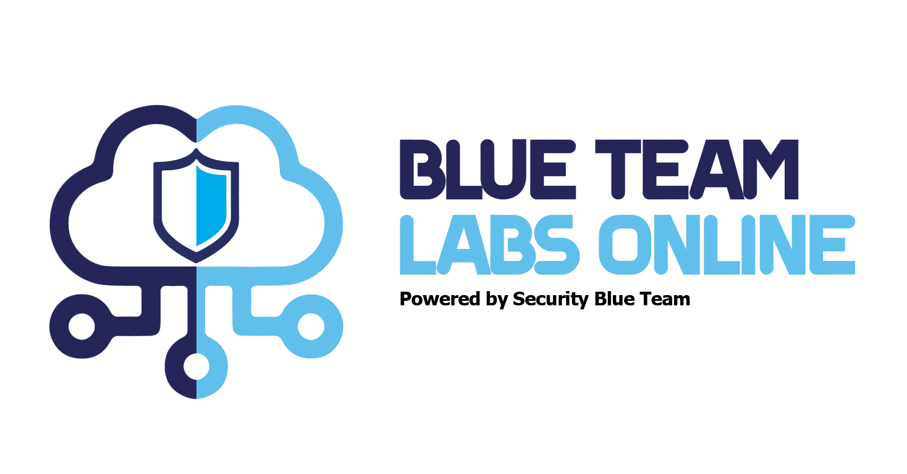

Este writeup documenta la resolución del laboratorio **"Bruteforce"** de Blue Team Labs Online, que simula un ataque de fuerza bruta contra un sistema. 

El objetivo es identificar y analizar la actividad maliciosa a través de registros de red y autenticación, determinando indicadores de compromiso (IoCs) como IPs y puertos de origen. Además, se proponen estrategias de mitigación para prevenir futuros ataques. 

Además, el ejercicio propone estrategias de mitigación y prevención que pueden ser implementadas para evitar que futuros ataques similares sean exitosos. Estas estrategias incluyen la implementación de controles de acceso más estrictos, la monitorización constante de los registros de autenticación y red, y el uso de mecanismos de protección como bloqueos automáticos tras múltiples intentos fallidos de autenticación.

Este ejercicio refuerza habilidades clave en detección y respuesta ante amenazas cibernéticas.

## **Enunciado:**

¿Puedes analizar los registros de un intento de ataque de fuerza bruta RDP?

Uno de nuestros administradores de sistemas identificó una gran cantidad de eventos de falla de auditoría en el registro de eventos de seguridad de Windows.

¡Hay varias maneras diferentes de abordar el análisis de estos registros! Considere las herramientas sugeridas, ¡pero hay muchas otras disponibles!

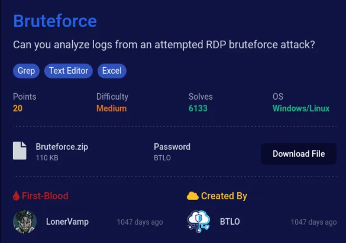

### PRIMEROS PASOS:

Primero descarguemos el archivo Bruteforce.zip:

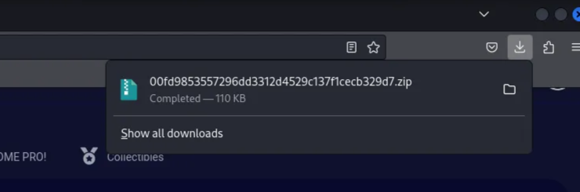

Una vez descargado entramos a nuestro terminal, buscamos el archivo en Downloads. Observamos que se encuentra comprimido, entonces lo descomprimimos para ver los archivos dentro.

<aside>

```bash
unzip   00fd9853557296dd3312d4529c137f1cecb329d7.zip
```

</aside>

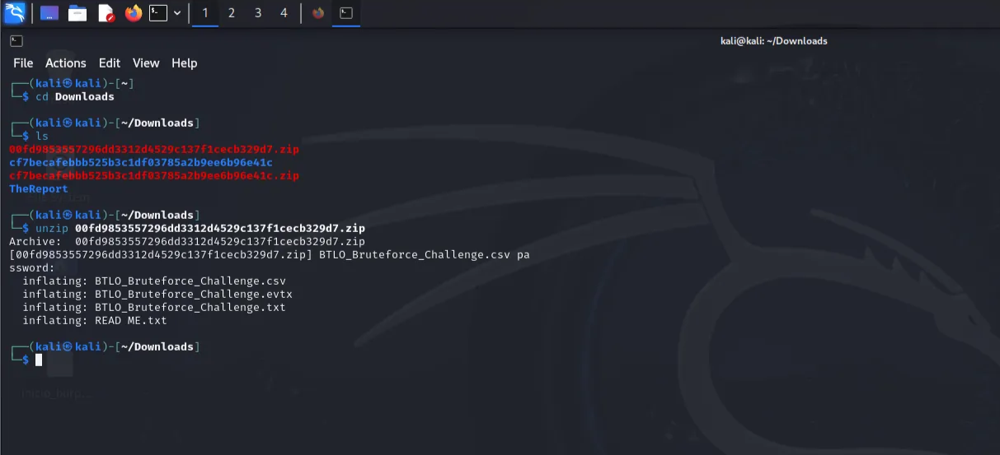

Una vez ejecutado el comando nos pedira la contraseña, esta se encuentra al costado del archivo cuando dimos en descargar y esta es :  BTLO

Ya descomprimido encontramos 3 archivos del laboratorio:

BTLO_Bruteforce_Challenge.csv

BTLO_Bruteforce_Challenge.evtx

BTLO_Bruteforce_Challenge.txt

Para completar este laboratorio usaremos BTLO_Bruteforce_Challenge.txt , debido a su simplicidad y compatibilidad con herramientas de línea de comandos como `grep`y `awk` .

# **RESPONDAMOS:**

### **1) ¿Cuántos eventos de falla de auditoría existen? (Formato: Conteo de Eventos)**

```bash
cat **BTLO_Bruteforce_Challenge.txt** | grep -i "failure" | sort | uniq -c
```

- **`cat BTLO_Bruteforce_Challenge.txt`**: Muestra el contenido del archivo.
- **`grep -i "failure"`**: Busca líneas que contienen la palabra "failure" (sin distinguir mayúsculas o minúsculas).
- **`sort`**:  Ordena alfabéticamente las líneas encontradas.
- **`uniq -c`**: Cuenta las repeticiones de cada línea única después de ordenar.

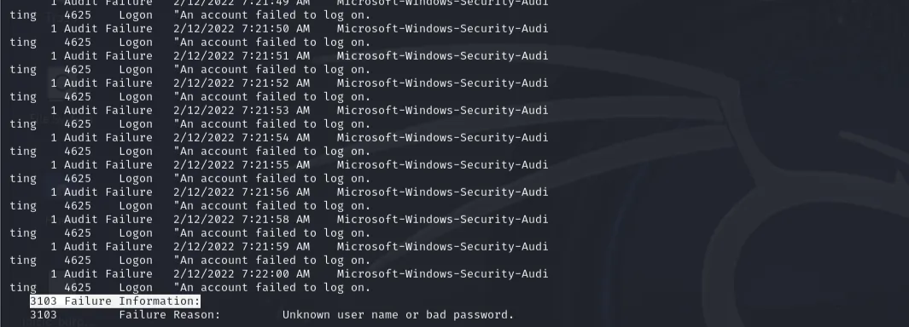

Ejecutamos el comando y nos da la respuesta a la pregunta: 3103 Failure Information

**Respuesta :** 3103

### **2) ¿Cuál es el nombre de usuario de la cuenta local a la que se dirige? (Formato: nombre de usuario)**

Ejecutamos el siguiente comando en nuestro terminal

```bash
cat **BTLO_Bruteforce_Challenge.txt** | less
```

- **`cat BTLO_Bruteforce_Challenge.txt`**: Muestra el contenido del archivo.
- **`less`**: Permite visualizar el contenido paginado, moviéndose hacia adelante y atrás con teclas como `Espacio` (avanzar) y `b` (retroceder).

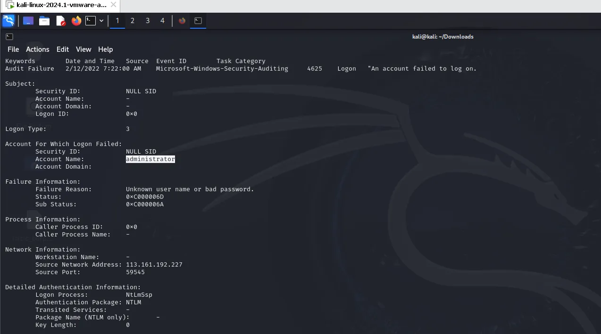

Buscamos Account Name y nos da la respuesta a la pregunta que es el nombre administrator

**Respuesta:** administrator

### **3) ¿Cuál es el motivo del fallo relacionado con los registros de fallos de auditoría? (Formato: Cadena**)

La respuesta se encuentra dentro del comando ejecutado anteriormente, buscamos Failure Reason y nos da la respuesta a la pregunta.

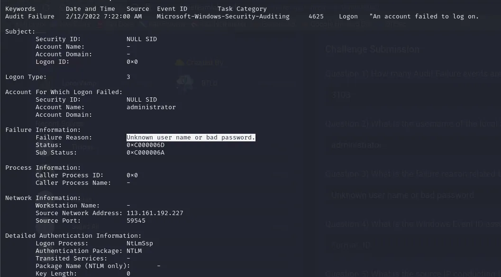

**Respuesta:** Unknown user name or bad password.

### **4) ¿Cuál es el ID de evento de Windows asociado con estos errores de inicio de sesión? (Formato:ID)**

La respuesta a esta pregunta se encuantra igualmente dentro del comando ejecutado, para esto buscamos Microsoft - Windows-Security-Auditing , lo cual  nos da 4625

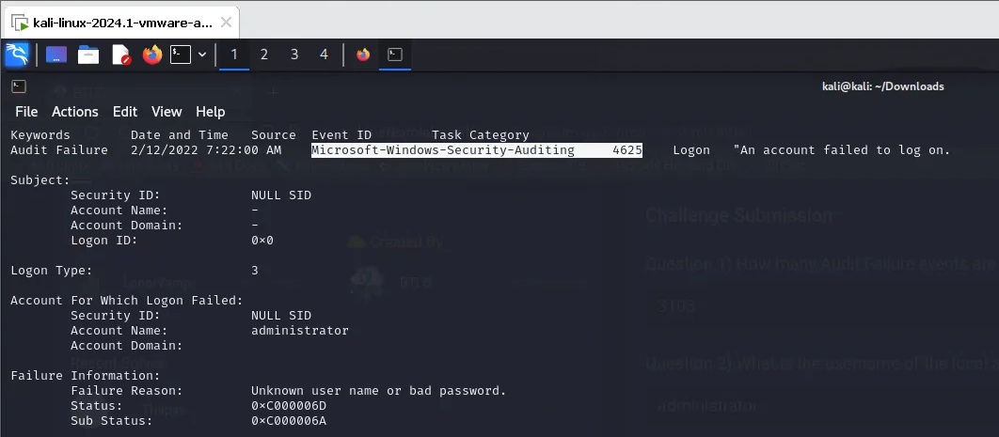

**Respuesta:** 4625

### **5) ¿Cuál es la fuente de IP que realiza este ataque? (Formato: X.X.X.X)**

```bash
cat **BTLO_Bruteforce_Challenge.txt** | grep "Source Network Address" | sort | uniq -c
```

- **`cat BTLO_Bruteforce_Challenge.txt`**: Muestra el contenido completo del archivo.
- **`grep "Source Network Address"`**: Filtra líneas que contienen la frase exacta `"Source Network Address"`, es decir, las que probablemente indican direcciones IP de origen de las conexiones.
- **`sort`**: Ordena las líneas alfabéticamente para facilitar la agrupación.
- **`uniq -c`**: Cuenta las repeticiones de cada línea única (direcciones IP de origen).

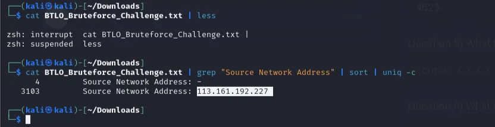

Una vez ejecutado el comando nos muestra la direccion IP del atacante en Source Network Address

**Respuesta:** 113.161.192.227

### **6) ¿A qué país está asociada esta dirección IP? (Formato: País)**

Para encontrar el pais asociado a esta IP podemos copiar la direccion IP:  113.161.192.227 , y buscar el Google su pais de origen.

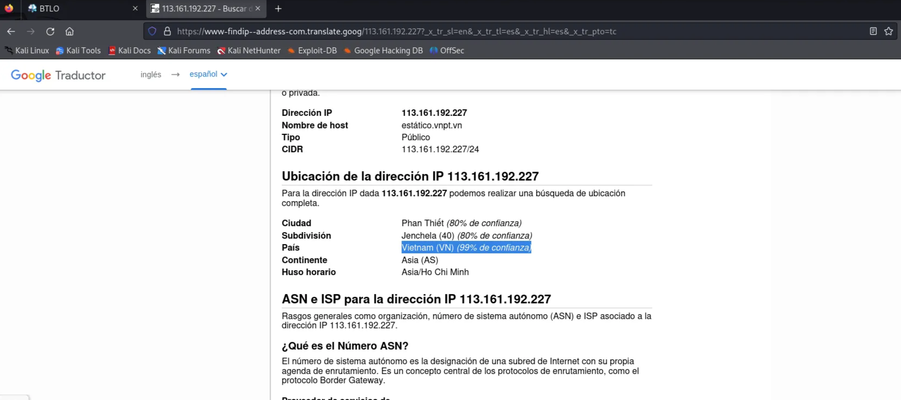

**Respuesta:** Vietnam

### **7) ¿Cuál es el rango de puertos de origen que utilizó el atacante para realizar estas solicitudes de inicio de sesión? (Puerto más bajo-Puerto más alto - Ej: 100-541)**

Valor más bajo: 49162

```bash
cat BTLO_Bruteforce_Challenge.txt| cut -d "," -f 1- | grep 'Source Port' | grep -v '-' | cut -d ":" -f 2 | sort -n | head -1
```

Valor más alto: 65534

```bash
cat BTLO_Bruteforce_Challenge.csv| cut -d "," -f 1- | grep 'Source Port' | grep -v '-' | cut -d ":" -f 2 | sort -n | tail -1
```

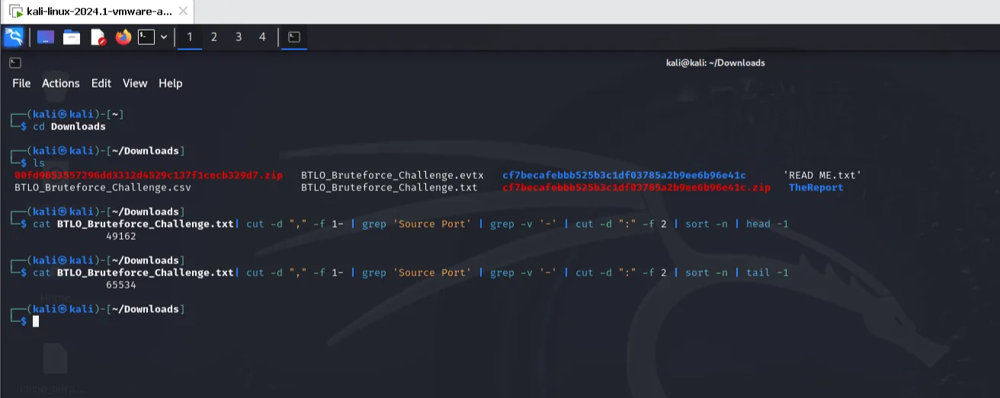

**Respuesa:** 49162-65534

### Felicidades, completaste todas las respuestas:

